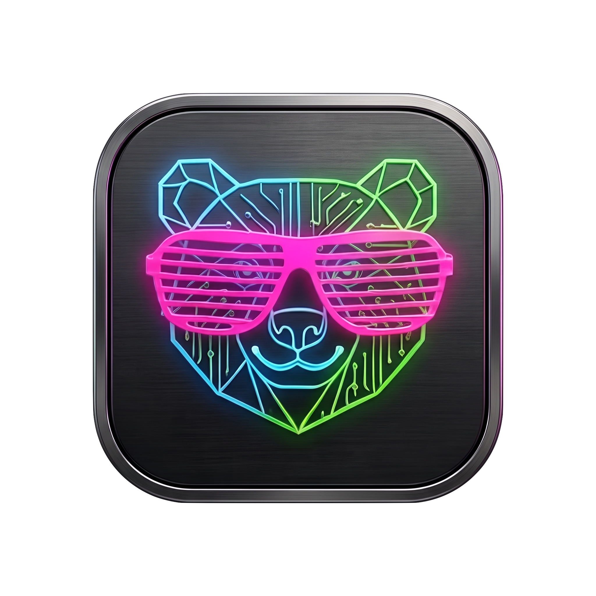
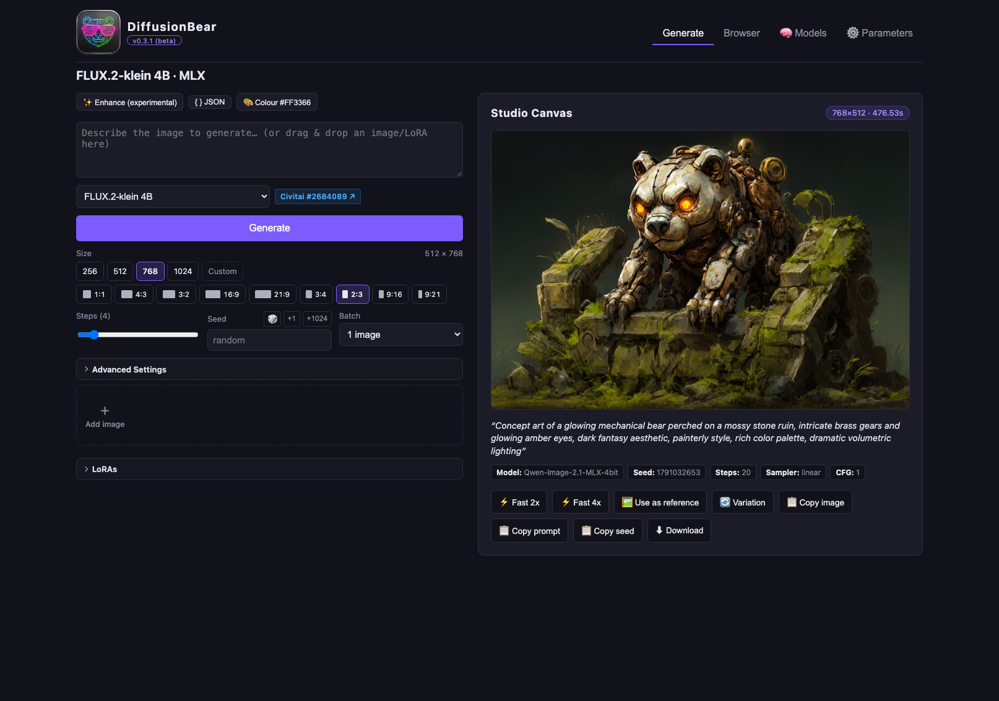
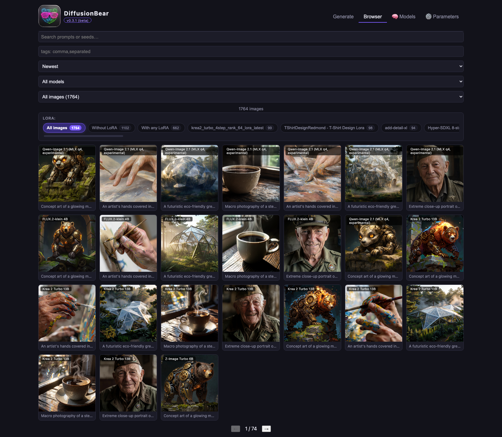
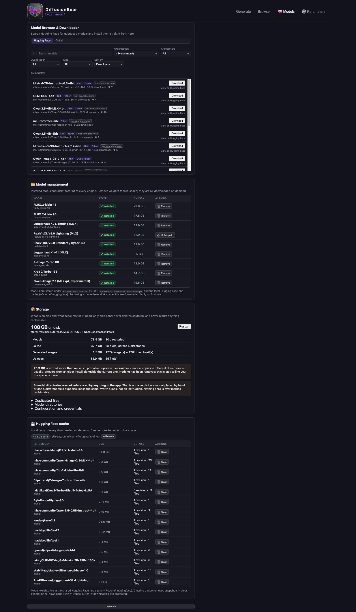
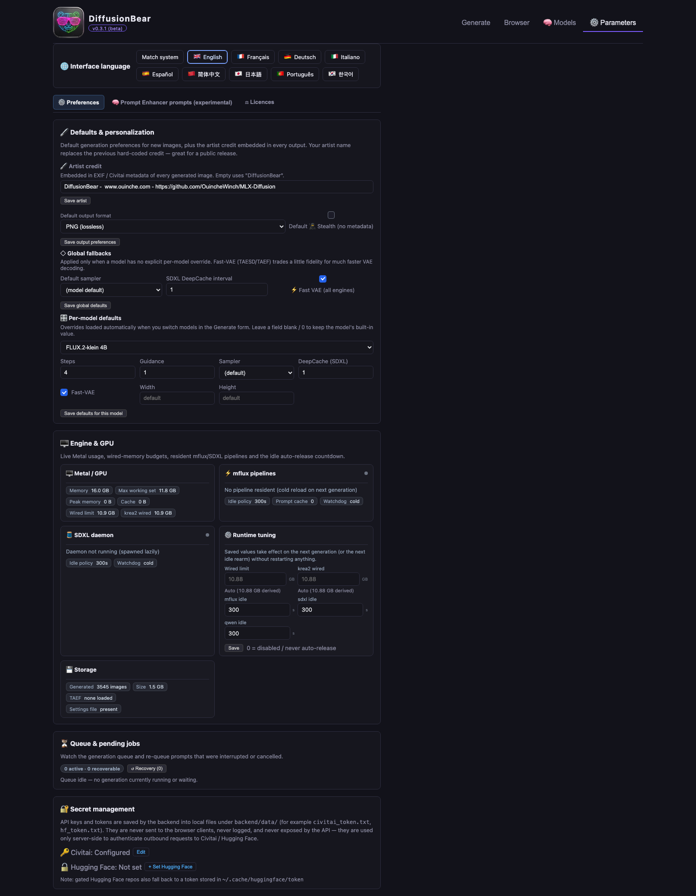
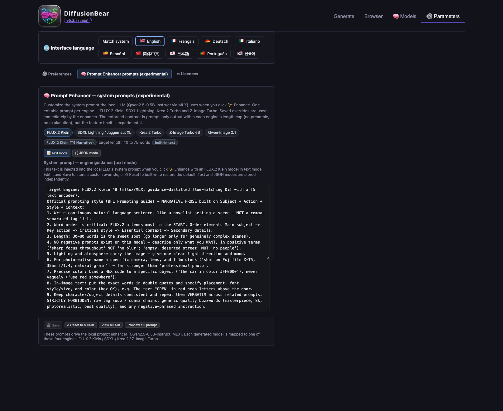
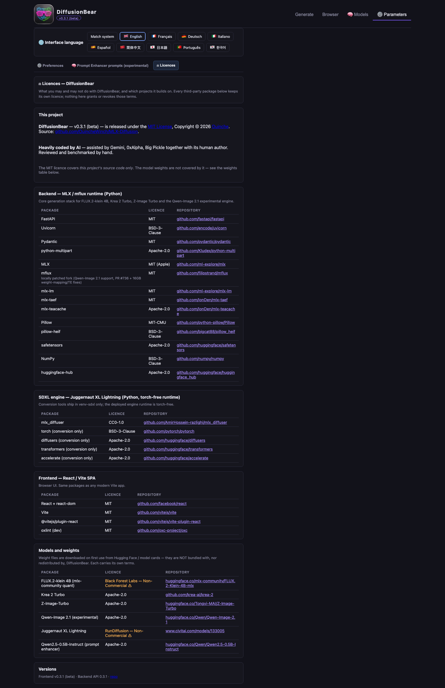
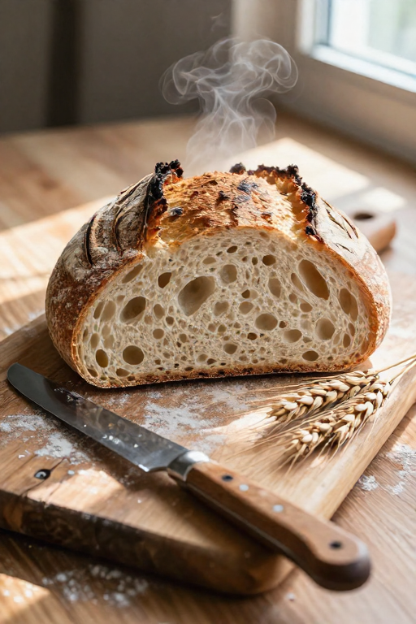
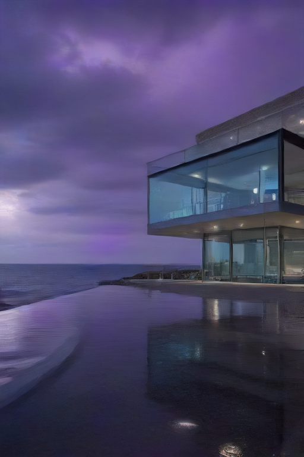

<p align="center">
  
</p>

<h1 align="center">DiffusionBear</h1>

<p align="center"><strong>Beta — v0.3.2</strong> &nbsp;·&nbsp; a local-first image generation studio for Apple Silicon</p>

---

**DiffusionBear** runs open-weight diffusion models on your own Mac. Generation,
prompt enhancement, LoRA management and the gallery all happen on the machine in
front of you: the API listens on `127.0.0.1:8001`, model weights are fetched once
into a local store, and nothing is uploaded anywhere. No account, no cloud, no
per-image billing.

It is built on Apple's [MLX](https://github.com/ml-explore/mlx) framework, so it is
**Apple Silicon only**. There is no CUDA or CPU path, and there is not going to be
one — MLX is macOS/Metal exclusive.

*Formerly called **MLX-Diffusion**; renamed in October 2026. The old repository URL
still redirects, and old search traffic still lands here.*

> **Beta, honestly.** 0.3.1 is the public beta of a one-person project. The core
> path — FLUX.2-klein and the SDXL engines — is the most used and the most tested.
> Engines marked *experimental* in the app (Qwen-Image 2.1) are unsupported
> previews: they can be slow, and Qwen needs roughly 5 GB of free memory before it
> starts, so it fails on a busy 16 GB machine. Bug reports and issues are welcome.

Made by **[Ouinche](https://www.ouinche.com)** — heavily coded by AI (Gemini,
0xAlpha, Big Pickle) — released under the [MIT licence](LICENSE).

---

## Get the app

The compiled macOS app is the main thing this project produces. `DiffusionBear.app`
is self-contained: it bundles the FastAPI backend, two relocatable Python runtimes
and the compiled single-page UI, and serves both the API and the interface from
`127.0.0.1:8001`. **There is nothing to install** — no Python, no Node, no virtual
environments on your side.



| | Detail |
|---|---|
| **Requires** | An Apple Silicon Mac, **macOS 15 (Sequoia) or later**. The bundle declares `LSMinimumSystemVersion 15.0`: MLX calls a Metal API that Sonoma does not have, so macOS refuses to launch it rather than crashing at import. |
| **First launch** | The app is ad-hoc signed, not notarised with an Apple Developer ID. macOS will therefore block a plain double-click the first time — **right-click the app → Open** to get past Gatekeeper. |
| **Your files** | Settings, gallery, LoRA registry and model store live in `~/Library/Application Support/DiffusionBear`, never inside the app bundle. To put the store on another volume, write an absolute path into `~/Library/Application Support/DiffusionBear/store_path`; a store path can be shared by several installs. |
| **Model weights** | Not bundled. They are downloaded on first use from Hugging Face or [Civitai](https://civitai.red/?ref_code=88C8VEBA) into that store — a few GB for the first model. After that the app works fully offline. |

<a href="https://github.com/OuincheWinch/DiffusionBear/releases/download/v0.3.2/DiffusionBear-0.3.2-arm64.zip">
  
</a>

**[⬇ Download DiffusionBear 0.3.2 for macOS (Apple Silicon)](https://github.com/OuincheWinch/DiffusionBear/releases/download/v0.3.2/DiffusionBear-0.3.2-arm64.zip)** — 482 MB, from the [v0.3.2 release](https://github.com/OuincheWinch/DiffusionBear/releases/tag/v0.3.2).

1. Unzip it and move `DiffusionBear.app` into `/Applications`.
2. **First launch only:** the app is ad-hoc signed, not notarised with an Apple
   Developer ID, so macOS refuses a plain double-click with *"Apple cannot check it for
   malicious software"*. **Right-click the app → Open → Open.** It is not malware; it is
   simply unsigned, and the warning does not return on later launches.
3. To check the download: `shasum -a 256 DiffusionBear-0.3.2-arm64.zip`, compared
   against the [`.SHA256SUMS`](https://github.com/OuincheWinch/DiffusionBear/releases/download/v0.3.2/DiffusionBear-0.3.2-arm64.zip.SHA256SUMS)
   published beside it.

Prefer to build it yourself? [Build it from `packaging/`](#build-the-app-yourself) — it
is three scripts and no decisions to make.

---

## Screenshots

| Generate | Browser |
|---|---|
|  |  |

| Models | Parameters |
|---|---|
|  |  |

| Prompt enhancer | Licences |
|---|---|
|  |  |

---

## What it does

**Models — find them, get them, make them runnable**

- **Browse and download from inside the app.** The Models tab searches
  **Hugging Face** and **[Civitai](https://civitai.red/?ref_code=88C8VEBA)**
  side by side, classifies results into the SDXL / FLUX.2 / Krea 2 / Z-Image
  buckets, and downloads with live progress, speed and cancel. A direct URL works
  too.
- **Convert single-file Civitai SDXL checkpoints** into runnable diffusers
  directories. The conversion runs out of process so a slow one cannot stall the
  API, and it repairs the two things diffusers otherwise chokes on: CLIP
  `text_model.*` key naming and the slow tokenizer's missing `vocab.json` /
  `merges.txt`.
- **Register a model you already have.** Point the app at a diffusers folder on
  disk or at a repo in your Hugging Face cache and it loads it in place — nothing
  is re-downloaded or copied.
- **Honest states.** A model that is present but not runnable (missing
  `model_index`, a stale `.incomplete` download) is reported as not runnable
  rather than as ready.

**Generating**

- Engine presets, batch counts, seed lock / random / +1 / +1024, guidance, negative
  prompts where the architecture supports them, and a sampler picker where it
  matters.
- **Reference images.** FLUX.2-klein takes up to 10 references referenced in the
  prompt as `Image 1`, `Image 2`, … ; Z-Image, Krea 2 and Qwen take one.
- **Generative fill.** Paint a mask on a gallery image and regenerate just that
  region (FLUX.2-klein only — it is the one engine with spatial conditioning).
- One generation at a time, behind a worker thread and a FIFO queue. This is
  deliberate; see [CONTRIBUTING.md](CONTRIBUTING.md).

**Prompt enhancement**

- A local **Qwen2.5-0.5B-Instruct 4-bit** model rewrites your prompt for the
  selected engine, in prose or in JSON, with editable per-engine system prompts.
- Active LoRA trigger words are preserved verbatim, with a deterministic
  re-insertion guarantee.

**LoRAs**

- Drag a `.safetensors` in, or import from [Civitai](https://civitai.red/?ref_code=88C8VEBA)
  with progress and cancel. FLUX.2 and SDXL formats are both supported, and SDXL
  adapters stack by rank-concat. Trigger words become clickable chips in the
  prompt box.

**Your library**

- A local gallery with tags, text search, and one-click **Use as Reference**.
- **2× / 4× Lanczos upscaling** with unsharp masking.
- **Civitai-compliant metadata**: every PNG embeds prompt, seed, steps, sampler,
  CFG, model and LoRA names/hashes as `tEXt` + EXIF, so the exact checkpoint and
  LoRAs are recognised automatically if you upload the image. A **stealth mode**
  omits all of it.
- Interface in English, French, German, Italian, Spanish, Simplified Chinese,
  Japanese, Portuguese and Korean.
- A **⚖ Licences** tab listing the licence of every bundled package and every
  supported model.

---

## Supported models

Nine checkpoints across five families, all quantised to 4-bit and memory-tuned for
16 GB of unified memory. Switching engine swaps weights on demand rather than
keeping everything resident.

| Model | Family | Default steps | Notes |
|---|---|---|---|
| **FLUX.2-klein 4B** | FLUX.2 | 4 | Up to 10 reference images, LoRA, guidance. No negative prompt (guidance-distilled). |
| **FLUX.2-klein 9B** | FLUX.2 | 4 | Same capabilities, roughly twice the cost per image. |
| **Z-Image Turbo 6B** | Z-Image | 6 | One reference image, LoRA. No guidance or negative prompt. |
| **Krea 2 Turbo 13B** | Krea 2 | 8 | One reference image, LoRA. At 4 steps the app auto-loads the Krea distilled 4-step LoRA, so 4 and 8 steps are two different pipelines, not one model at two budgets. |
| **Qwen-Image 2.1** | Qwen-Image | 25 | **Experimental.** One reference image, negative prompts supported, no LoRA. Needs ~5 GB free memory; its bf16 VAE decode can exhaust Metal on a busy 16 GB machine. |
| **Juggernaut XL Lightning** | SDXL | 4 | Distilled 4-step + TAESD decode — the fastest combo here. Sampler picker, negative prompts, DeepCache. |
| **RealVisXL V5.0 Lightning** | SDXL | 6 | As above, distilled 6-step. |
| **RealVisXL V5.0 (Hyper-SD)** | SDXL | 25 | Base checkpoint with an 8-step Hyper-SD draft preset. |
| **Juggernaut XI v11 (Hyper-SD)** | SDXL | 25 | Base checkpoint with an 8-step Hyper-SD draft preset. |

---

## Local by design

Every part of the pipeline runs from your Mac's own memory:

- **Generation runs on the Metal GPU** through MLX (`mflux` for the flow-matching
  models, a native MLX SDXL daemon for the SDXL checkpoints). Weights are 4-bit so
  a 4–13 B parameter model fits the 16 GB unified memory of an M1 MacBook Pro.
- **The prompt enhancer is a local LLM too**, so rewriting a prompt never leaves the
  machine either.
- **No telemetry, no analytics, no network calls at generation time.** Once the
  weights are cached the app works fully offline.
- **No data leaves your computer while generating.** The only moment anything is
  transmitted is when *you* explicitly download weights, or export an image
  somewhere. Tokens are stored on your disk and sent only to the service they
  belong to.

Unified memory is why this works at all on a 16 GB machine: the CPU and GPU share
one pool, so a quantised model stays resident with no CPU↔GPU copying — which is
exactly what MLX is built to exploit.

### Optional tokens

No account is needed to generate. Two optional tokens make downloads smoother:

| Token | Why it helps | Where |
|---|---|---|
| **[Civitai](https://civitai.red/?ref_code=88C8VEBA) API key** | Resumable LoRA and checkpoint downloads; some model versions are auth-gated | Settings → Tokens, or env `CIVITAI_API_KEY` |
| **Hugging Face token** | Unlocks gated and private models, and avoids first-download rate limits | Settings → Tokens, or env `HF_TOKEN` (or `huggingface-cli login`) |

---

## Benchmarks

Measured on a **2021 MacBook Pro M1 (16 GB)** — the reference machine this project is
tuned for. This table is a **September 2026 snapshot** (293 timed studio
generations plus an 18-run repeatability suite). Defaults have moved since — Z-Image
Turbo in particular now starts at 6 steps instead of 8 — so read it as a record of
that build, not as a promise about 0.3.1.

**Methodology — removing load spikes:** within each model × resolution bucket the
**5% fastest and 5% slowest times are excluded** before computing mean and median
(other Metal work on the machine routinely inflates outliers). Aborted records
(<2 s) are dropped; single-sample buckets are kept as indicative only.

| Model | Resolution | Steps | n (trim) | Mean | Median | Trimmed range |
|---|---|---|---|---|---|---|
| **FLUX.2-klein 4B** | 512×512 | 4 | 5/7 | 45 s | 48 s | 38 – 51 s |
| **FLUX.2-klein 4B** | 512×768 | 4 | 2/2 | 55 s | 55 s | 54 – 56 s |
| **FLUX.2-klein 4B** | 768×768 | 4 | 2/2 | 1:16 min | 1:16 min | 1:14 – 1:19 min |
| **FLUX.2-klein 4B** | 768×1152 | 4 | 2/4 | 5:02 min | 5:02 min | 4:53 – 5:11 min |
| **FLUX.2-klein 4B** | 1024×1024 | 4 | 1/1 | 2:03 min | 2:03 min | — |
| **FLUX.2-klein 9B** | 512×768 | 4 | 1/1 | 1:51 min | 1:51 min | — |
| **FLUX.2-klein 9B** | 768×1152 | 4 | 4/6 | 7:14 min | 6:46 min | 4:17 – 11:04 min |
| **Juggernaut XL Lightning (SDXL)** | 512×512 | 4 | 2/4 | 22 s | 22 s | 10 – 33 s |
| **Juggernaut XL Lightning (SDXL)** | 512×768 | 4 | 25/27 | **9 s** | **9 s** | 9 – 11 s |
| **Juggernaut XL Lightning (SDXL)** | 832×1216 | 4 | 14/16 | 2:08 min | 1:57 min | 1:21 – 3:13 min |
| **Juggernaut XL Lightning (SDXL)** | 1024×1024 | 4 | 1/1 | 1:06 min | 1:06 min | — |
| **Juggernaut XI v11 (SDXL)** | 512×768 | 8 | 10/12 | 50 s | 49 s | 42 s – 1:11 min |
| **Krea 2 Turbo 13B** | 512×512 | 8 | 7/9 | 2:44 min | 2:44 min | 1:38 – 3:36 min |
| **Krea 2 Turbo 13B** | 512×768 | 4* | 41/45 | 3:41 min | 2:51 min | 1:22 – 6:40 min |
| **RealVisXL V5.0 (SDXL)** | 512×768 | 8 | 10/12 | 1:00 min | 55 s | 46 s – 1:21 min |
| **RealVisXL V5.0 Lightning (SDXL)** | 512×512 | 6 | 23/25 | 23 s | 22 s | 20 – 27 s |
| **RealVisXL V5.0 Lightning (SDXL)** | 512×768 | 6 | 27/29 | 33 s | 31 s | 30 – 51 s |
| **RealVisXL V5.0 Lightning (SDXL)** | 768×768 | 6 | 2/4 | 2:48 min | 2:48 min | 2:44 – 2:53 min |
| **RealVisXL V5.0 Lightning (SDXL)** | 832×1216 | 6 | 2/4 | 3:31 min | 3:31 min | 3:17 – 3:45 min |
| **RealVisXL V5.0 Lightning (SDXL)** | 1024×1024 | 6 | 2/2 | 1:55 min | 1:55 min | 1:53 – 1:57 min |
| **Z-Image Turbo 6B** | 512×512 | 8 | 46/52 | 1:42 min | 1:43 min | 1:15 – 2:13 min |
| **Z-Image Turbo 6B** | 512×768 | 8 | 16/18 | 2:22 min | 2:22 min | 1:57 – 2:43 min |
| **Z-Image Turbo 6B** | 768×768 | 8 | 3/5 | 3:49 min | 3:44 min | 3:44 – 3:59 min |
| **Qwen-Image 2.1** | 512×768 | 20 | 10/10 | 7:38 min | 7:36 min | 7:10 – 8:05 min |

`n (trim)` = samples kept after removing the fastest/slowest 5% out of the raw
count. `*` 4-step Krea runs use the Krea 2 distilled 4-step LoRA. `—` = single-sample
bucket.

**Repeatability suite (Sep 20, run under elevated system load up to ~9):**

| Model | Resolution | n | Mean | Median |
|---|---|---|---|---|
| FLUX.2-klein 4B | 768×768 | 11 (9) | 1:15 min | 1:14 min |
| FLUX.2-klein 4B | 1024×1024 | 2 | 2:02 min | 2:02 min |
| Z-Image Turbo 6B | 768×768 | 2 | 2:54 min | 2:54 min |
| Juggernaut XL Lightning (SDXL) | 1024×1024 | 1 | 1:07 min | 1:07 min |
| Krea 2 Turbo 13B | 1024×1024 | 2 | 12:16 min | 12:16 min |

**How to read it:** Juggernaut XL Lightning at 512×768 is by far the fastest combo
(median 9 s — distilled 4 steps plus a TAESD decode); Z-Image Turbo costs more than
an order of magnitude as much at the same size (2:22 median), and FLUX.2-klein
sits in between with the most resolution flexibility. The wide trimmed ranges on
the 512×768 buckets (Krea, Z-Image, Juggernaut at 832×1216) are exactly the load
spikes this methodology filters — treat medians, not means, as the stable number.
The Qwen-Image 2.1 row comes from a separate controlled sweep (10 scenes, seeds
1001–1010, 20-step linear, guidance 1.0) which also confirmed its 64-channel RGBA
VAE handles 512×768 on a 16 GB M1 without running out of memory.

---

## Model vs model — visual arena

Head-to-head repeatability comparisons on original, royalty-free scenes — a
sourdough loaf, a cliff villa, a snow leopard, no copyrighted characters. Each duel
plays *right here in the README* as a muted auto-wiping divider video; for the
**draggable** version, open
[ouinche.com/mlx-diffusion-yet-another-open-source-image-generator-on-apple-silicon](https://www.ouinche.com/mlx-diffusion-yet-another-open-source-image-generator-on-apple-silicon/)
in a browser. GitHub strips JavaScript from READMEs, so a slider cannot render on
the repo page — the moving divider is the closest thing that does.

### FLUX.2-klein 4B vs Z-Image Turbo 6B — "Rustic Sourdough" (512×768)

<video muted loop autoplay playsinline controls poster="docs/model-arena/images/flux2_klein_sourdough.png">
  <source src="docs/model-arena/images/arena_flux2_vs_zimage.mp4" type="video/mp4">
</video>

| FLUX.2-klein 4B | Z-Image Turbo 6B |
|---|---|
|  |  |

### FLUX.2-klein 4B vs Juggernaut XL Lightning — "Modern Glass Villa" (512×768)

<video muted loop autoplay playsinline controls poster="docs/model-arena/images/flux2_klein_villa.png">
  <source src="docs/model-arena/images/arena_flux2_vs_juggernaut.mp4" type="video/mp4">
</video>

| FLUX.2-klein 4B | Juggernaut XL Lightning |
|---|---|
|  |  |

### FLUX.2-klein 4B vs Krea 2 Turbo 13B — "Snow Leopard" (512×768)

<video muted loop autoplay playsinline controls poster="docs/model-arena/images/flux2_klein_leopard.png">
  <source src="docs/model-arena/images/arena_flux2_vs_krea.mp4" type="video/mp4">
</video>

| FLUX.2-klein 4B | Krea 2 Turbo 13B |
|---|---|
|  |  |

---

## Build the app yourself

The bundle is assembled by three scripts, in this order:

```bash
packaging/build_runtime_venv.sh   # main runtime: Python 3.10 + mflux
packaging/build_sdxl_venv.sh      # SDXL engine runtime: Python 3.14 + mlx_diffuser
packaging/build_app.sh            # assembles and ad-hoc signs DiffusionBear.app
```

They write to `packaging/dist/DiffusionBear.app`. Install it with a copy, not
`ditto` (see the note at the end of `build_app.sh`):

```bash
rm -rf /Applications/DiffusionBear.app
cp -R packaging/dist/DiffusionBear.app /Applications/
```

Two things worth knowing before you touch these scripts. The runtimes are
[python-build-standalone](https://github.com/astral-sh/python-build-standalone)
interpreters, **not** a copy of `venv/` — a repo venv points at a Homebrew install
and is not relocatable, which is precisely what breaks inside a bundle. And
`build_app.sh` audits the result and **fails the build** if it finds model weights,
credential-shaped files, or unexpected large files outside the runtimes; if it
complains, do not ship the bundle.

---

## Build from source

If you would rather run it from a checkout than install the app — for development,
or to read it — the source is the whole thing and there are two ways to launch it.

**Requirements:** an Apple Silicon Mac (16 GB+ recommended), Python 3.10 and
Python 3.14, Node.js 18+.

```bash
git clone https://github.com/OuincheWinch/DiffusionBear.git
cd DiffusionBear
```

Both virtual environments are required: `venv/` for the main engine,
`venv-sdxl/` for the isolated SDXL engine.

```bash
python3 -m venv venv
python3 -m venv venv-sdxl

./venv/bin/python -m pip install -r backend/requirements.txt
./venv-sdxl/bin/python -m pip install -r backend/requirements-sdxl.txt

cd frontend && npm install && cd ..
```

Then launch everything — backend, frontend and browser:

```bash
./run.sh
```

`run.sh` starts FastAPI on **8001**, Vite on **5174**, opens the UI, and keeps the
Mac awake with `caffeinate` during long renders. `CTRL+C` stops everything. The
first generation downloads the model weights once (a few GB into the Hugging Face
cache); after that it runs offline.

> **Ports 8001 and 5174 are deliberate.** 8000 and 5173 belong to other tools on
> the author's machine. Do not "fix" them.
>
> Launch the backend with `./venv/bin/python -m uvicorn …`, never
> `./venv/bin/uvicorn` — the venv console-script shebangs can point at a stale
> interpreter after the project folder is renamed, and the app then silently boots
> with the wrong `mflux`. `run.sh` already resolves the right one.

### Development mode (two terminals)

```bash
./dev-backend.sh                   # FastAPI, port 8001, hot reload
cd frontend && npm run dev         # Vite, port 5174, hot reload
```

Free a stuck service with `lsof -ti :8001,5174 | xargs kill -9`.

Other frontend tasks: `npm run lint` (oxlint) and `npm run build` (production
bundle). The GitHub Actions workflow compiles the backend, runs its test suite, and
runs frontend lint plus build on every push to `main` and on every pull request.

Your first prompt — FLUX.2-klein 4B at 4 steps is a good first run:

> A mischievous baby otter wearing a tiny yellow developer helmet, sitting in
> front of a futuristic glowing computer setup. The glowing computer screen
> clearly displays the words "HELLO WORLD" in vibrant neon text. Warm studio
> lighting, shallow depth of field, 8k resolution, cinematic photorealism.


### Uninstall

Check the path twice, then:

```bash
cd /path/to/your/DiffusionBear
cd .. && rm -rf DiffusionBear
```

To leave nothing behind:

```bash
python3 -m pip cache purge     # downloaded wheels and packages
npm cache clean --force        # npm cache
```

### Repository layout

| Path | What it is |
|---|---|
| `backend/` | FastAPI service (`main.py`), generation engines (`generator.py`, `sdxl_engine.py`, `qwen_engine.py`), model registry and the Hugging Face / Civitai / SDXL-conversion clients |
| `frontend/` | React 19 + Vite single-page UI |
| `packaging/` | Scripts and Swift shell that build and sign `DiffusionBear.app` |
| `docs/` | Assets used by this README, including the interactive benchmark arena |
| `test/` | Benchmark, A/B and repeatability harnesses, and the runs they recorded |

Longer guides: [`readme.txt`](readme.txt) (models, tuning rules, troubleshooting)
and [`USER_GUIDE.md`](USER_GUIDE.md).

---

## Documentation

- [CHANGELOG.md](CHANGELOG.md) — what changed in each release
- [CONTRIBUTING.md](CONTRIBUTING.md) — how to build, verify and propose a change
- [SECURITY.md](SECURITY.md) — privacy posture and how to report a vulnerability
- [readme.txt](readme.txt) / [USER_GUIDE.md](USER_GUIDE.md) — full usage guide

---

## Author and AI-assisted development

DiffusionBear is written and maintained by **[Ouinche](https://www.ouinche.com)**
(<https://github.com/OuincheWinch>), and is **heavily coded by AI** — Gemini,
0xAlpha and Big Pickle do a large share of the writing. That is a deliberate
choice, not an accident, and it is why the contribution rules ask for a human
review and a measurement alongside every change.

## Security

Please **do not open a public issue** for a security problem. Use GitHub's
[private vulnerability report](https://github.com/OuincheWinch/DiffusionBear/security/advisories/new),
or email the author with the subject `[DiffusionBear security]`. Acknowledgement
within 3 working days; treat proof-of-concepts as embargoed until the issue is
fixed or declined. Scope and the privacy posture are in [SECURITY.md](SECURITY.md).

## License

[MIT](LICENSE) — Copyright © 2026 **[Ouinche](https://www.ouinche.com)**. This
covers the project's source code only. Model weights carry their own terms (FLUX.2
is Black Forest Labs non-commercial; the Juggernaut and RealVisXL checkpoints are
non-commercial too), and none of them are redistributed here — they are downloaded
from Hugging Face or [Civitai](https://civitai.red/?ref_code=88C8VEBA) on first
use. The app shows the full per-package and per-model licences in its **⚖
Licences** tab.
